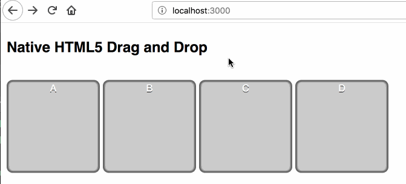
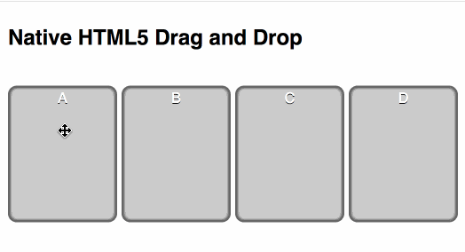
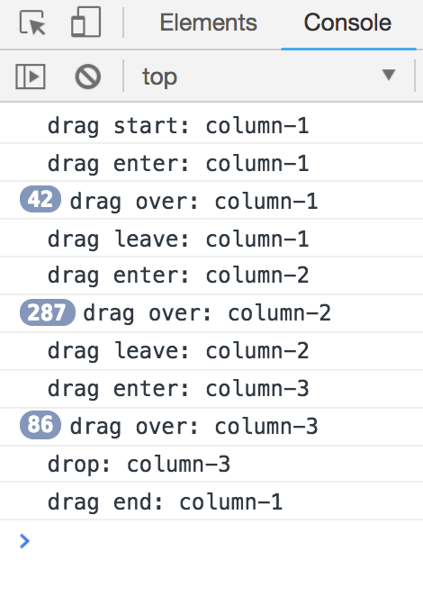
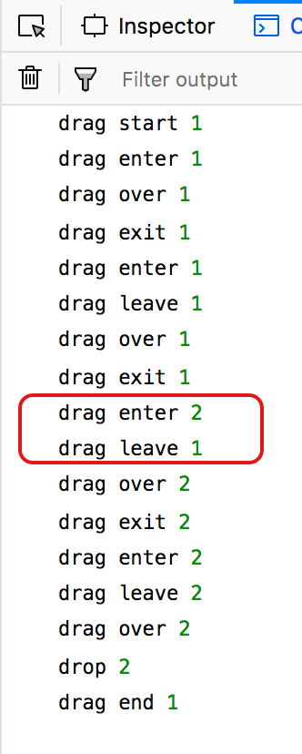
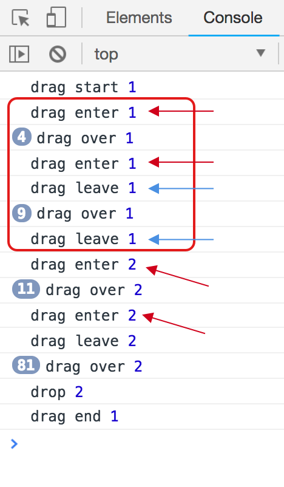
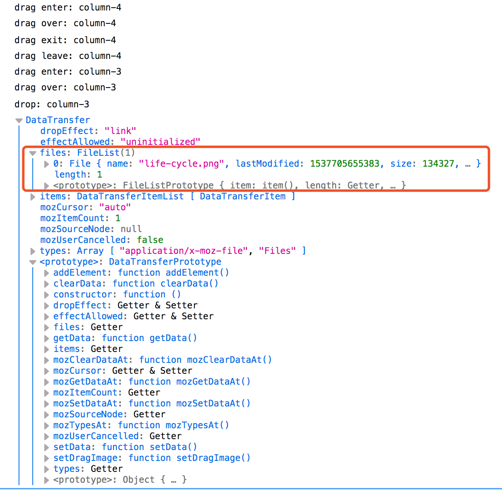
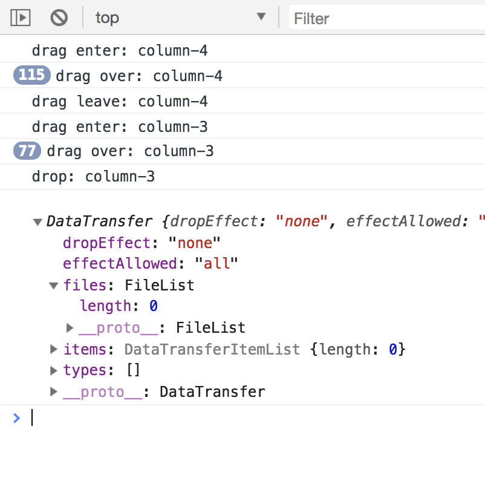
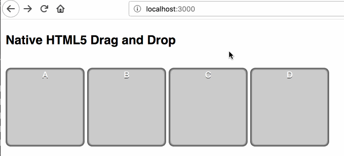

# HTML5 Drag and Drop Summary

## References

- [本机 HTML5 拖放](https://www.html5rocks.com/zh/tutorials/dnd/basics/)
- [HTML Drag and Drop API](https://developer.mozilla.org/en-US/docs/Web/API/HTML_Drag_and_Drop_API)
- [Beautiful react dnd from egghead](https://github.com/baurine/egghead-beautiful-react-dnd)

## Demo

## Drag and Drop Life Cycle

注 1: onDragExit (dragexit) 事件只有 Firefox 支持，忽略之

注 2: onDragLeave (dragleave) 和 onDrop (drop) 在同一个 drop target component 上只会发生一个，要么 onDragLeave，要么 onDrop

## Note

Drag and drop 的整个生命周期如上所示，在整个周期中，有 drag source 和 drop target 两类 component，需要将 drag source 的 draggable 属性置为 true，才能被拖动 (对 drop target 没有要求)，两者之间通过 event.dataTransfer (后面会详细讲一下 dataTransfer 的使用) 或者全局变量传递数据。

我们一般会在生命周期中进行以下操作：

- 在 onDragStart 中保存拖动的数据源，修改 drag source 的样式

        var dragSrcEl = null
        function handleDragStart(e) {
          console.log('drag start:', e.target.id)

          // this / e.target is current target element
          this.style.opacity = '0.4'
          dragSrcEl = this
          e.dataTransfer.setData('text/html', this.innerHTML)
        }

- onDrag 事件一般情况下我们不关心，除非你的页面要根据 drag 的距离，时间来发生变化，则需要处理

- 在 onDragEnter 中修改 drop target 的样式

        function handleDragEnter(e) {
          console.log('drag enter:', e.target.id)
          this.classList.add('over')
        }

- 在 onDragOver 中，一般只要进行的操作就是执行 `event.preventDefault()` 来阻止拖拽的默认操作。尚不清楚这个默认操作是什么，但如果你不在 onDragOver 事件中执行这个操作，onDrop 事件就不会发生，Chrome 和 Firefox 皆如此。因为这个事件发生很频繁，所以不适合在这个事件中处理过于繁重的事情，比如修改样式，这就是为什么我们要把修改样式的工作放到 onDragEnter 中

        function handleDragOver(e) {
          console.log('drag over:', e.target.id)
          e.preventDefault() // Necessary. Allows us to drop.
        }

- 在 onDragLeave 中，恢复 drop target 的样式 (如果发生了 onDrop，则 onDragLeave 不会发生，所以恢复 drop target 样式的工作在 onDrop 或 onDragEnd 中也要处理)

        function handleDragLeave(e) {
          console.log('drag leave:', e.target.id)
          this.classList.remove('over')
        }

- 在 onDrop 中，处理拖拽的真正逻辑，一般是实现数据交换

        function handleDrop(e) {
          console.log('drop:', e.target.id)
          e.preventDefault() // stop the browser from redirection

          // swap
          if (dragSrcEl != this) {
            dragSrcEl.innerHTML = this.innerHTML
            this.innerHTML = e.dataTransfer.getData('text/html')
          }
        }

  另外，在 onDrop，`event.preventDefault()` 也是几乎必须执行的操作，用来阻止拖拽的默认操作。但实际这个操作只是为了兼容 Firefox，在 Chrome 上不执行这个操作是没有问题的。在 Firefox 上，如果 event.dataTransfer 中的 data 是链接，那么拖拽的默认操作是跳转到此链接。

  假如在 onDragStart 中 dataTransfer 中设置的数据是这样的：

        function handleDragStart(e) {
          e.dataTransfer.setData('text/plain', 'https://www.google.com')
          // or
          // e.dataTransfer.setData('text', 'anything')
        }

  那么在 onDrop 中，如果没有 `event.preventDefault()`，在 Firefox 上的效果这样的：

  

  `e.dataTransfer.setData('text', 'anything')` 的默认操作是跳转到 `https://www.anything.com`

  但如果设置是的 `e.dataTransfer.setData('aaa', 'anything')` 则不会发生跳转，anyway，就干脆加上 `event.preventDefault()` 就对了。也许你会问，为什么会往 dataTransfer 中设置 'aaa' 这样奇怪的数据呢，不往 dataTransfer 中设置数据行不行，答案是不行，在 Firefox 上如果 dataTransfer 中没有 data，Firefox 会认为你不是真的想拖拽，然后拖拽就会失败，所以我们就要往里面随便塞点数据。

  - [Why doesn't HTML5 drag and drop work in Firefox?](https://stackoverflow.com/questions/19055264/why-doesnt-html5-drag-and-drop-work-in-firefox)

  在 Chrome 上不会发生跳转，所以不也强制在 onDragStart 中往 dataTransfer 存数据。

- 在 onDragEnd 中进行一些清理工作，比如恢复 drag source 和 drop target 的样式，因为 onDragLeave 和 onDrop 并不能保证都发生，但 onDragEnd 肯定是会发生的

        function handleDragEnd(e) {
          console.log('drag end:', e.target.id)
          // reset
          dragSrcEl = null
          this.style.opacity = ''
          [].forEach.call(cols, function (col) {
            col.classList.remove('over')
          });
        }

### 示例及特殊情况

将 column-1 element 拖动，经历 column-2 和 column-3，最终在 column-3 放下，整个过程是这样的：

column-1 (drag source) | column-2 (drop target) | column-3 (drop target)
-----------------------|------------------------|------------------------
onDragStart            |                        |
onDrag...              |                        |
...                    | onDragEnter            |
...                    | onDragOver...          |
...                    | onDragOver             |
...                    | onDragLeave            |
...                    |                        | onDragEnter
...                    |                        | onDragOver...
onDrag                 |                        | onDragOver
&nbsp;                 |                        | onDrop
onDragEnd              |                        |

在 Chrome 上运行时，整个过程和预期一致，但在 Firefox 上运行，不知道是不是 Firefox 的 bug，经常会出现后一个 component 的 enter 事件出现在前一个 component 的 leave 事件之前。

### React

在 React 中处理 Drag and Drop 和处理原生事件差不多。

    renderItem = (item_id, index) => {
      const item = this.state.data.items[item_id]
      return (
        
this.handleDragStart(e, item, index)}
            onDrag={(e)=>this.handleDrag(e, item)}
            onDragEnd={(e)=>this.handleDragEnd(e, item)}

            onDragEnter={(e)=>this.handleDragEnter(e, item)}
            onDragOver={(e)=>this.handleDragOver(e, item)}
            onDragExit={(e)=>this.handleDragExit(e, item)}
            onDragLeave={(e)=>this.handleDragLeave(e, item)}
            onDrop={(e)=>this.handleDrop(e, item, index)}>
          <h1>{item.title}</h1>
        

      )
    }

但在 Firefox 上，和原生的 Drag and Drop 事件一样，也存在相同的问题，后一个 component 的 enter 事件发生在前一个 component 的 leave 之前。

更糟糕的是，在 Chrome 和 Firefox 还存在一个问题，会连续发生两次 onDragEnter，再连续两次 onDragLeave，如下图所示 (React 16.5.2，Chrome: 69.0.3497.100，Firefox: 62.0)：

这导致的问题是，onDragLeave 变得不可靠，我们一般会在 onDragLeave 中恢复 drop target 的样式，但实际在连续两次 onDragEnter 后的第一次 onDragLeave 发生后，拖拽并没有离开这个 drop target，drop target 还会响应 onDragOver 事件。

不确实这是不是 React 的 bug，但我现在不会在 onDragLeave 中处理任何逻辑，而是把它放到 onDrop 或 onDragEnd 中处理。

### dataTransfer

前面我们说道 dataTransfer 是用来在拖拽源和放置目标之间传递数据用的，你可能或疑问，为什么需要这个东东，我直接把源数据放在全局变量里不行吗?

如果只是在同一个页面内操作，实际上是可以的，像用 React 实现时，我们就必须放在 state 中。

但是 HTML5 的 Drag and Drop API 是支持从网页中拖拽到桌面，或是从桌面拖拽到网页中的，这个时候，全局变量的方法就不可行的，我想这是为什么需要 dataTransfer 的原因。而 Firefox 也强制你必须在 onDragStart 中往 dataTransfer 中设置 data，即使是在同一个页面内拖拽，否则认为你不是真的想要拖拽 (没数据你拖拽啥)，从而导致拖拽不可用，所以一般这时候我们就会随便往 dataTransfer 中赋一些值，Chrome 没有这个要求。

因为支持从桌面拖拽到网页，所以在上面第一个例子的 onDrop 事件中，可能存在 dragSrcEl 为 null 的情况，我们要加上判断以增强程序的健壮性。

    function handleDrop(e) {
      console.log('drop:', e.target.id)
      e.preventDefault() // stop the browser from redirection in firefox

      // swap
      // drop event maybe caused by draging from desktop, so dragSrcEl maybe null
      if (dragSrcEl && dragSrcEl != this) {
        dragSrcEl.innerHTML = this.innerHTML
        this.innerHTML = e.dataTransfer.getData('text/html')
      }
    }

我们在 onDrop 中打印一下 event.dataTransfer，然后拖拽一个文件进来看看这个值是什么。

    function handleDrop(e) {
      console.log(e.dataTransfer)
      ...
    }

在 Firefox 上的输出:

在 Chrome 上的输出:

这种情况下，没有 onDragStart/onDrag/onDragEnd 事件，只有 onDragEnter/onDragOver/onDragLeave 或 onDrop 事件。

但 Firefox 和 Chrome 上 dataTransfer 的值不一样，需要做兼容性处理。

dataTransfer 的常见方法和属性：

- setData(key, value)
- getData(key)
- setDragImage(imgElement, x, y)
- effectAllowed: none, copy, copyLink, copyMove, link, linkMove, move, all 和 uninitialized
- dropEffect: none, copy, link, move

`setData(key, value)` 和 `getData(key)` 是配套使用的。在 HTML5 中，key 可以是任意值，但如果 key 是标准中指定的一些值，比如 'text' 或 'text/plain', 'url' 等，则在 onDrop 中如果没有 preventDefault()，则会触发默认操作，比如跳转到 value 中指定的网址去。(在以前或一些浏览器上，key 只支持某些固定值，比如 'text' 或 'url')

`setDragImage()` 是用来改变拖拽时随光标一起移动的图片，默认是拖拽源的镜像但透明度更低。(用到时再补充)

effectAllowed 和 dropEffect 也是配套使用的，两个值要匹配，才能拖拽成功，否则失败。

effectAllowed 是在 onDragStart 中给拖拽源所赋的值，dropEffect 是在 onDragOver 中给放置目标所赋的值。effectAllowed 表明拖拽源所期望放置目标的类型，比如 effectAllowed 值为 copy，则遇到 dropEffect 也为 copy 的放置目标时才能放置，否则不行。如果 effectAllowed 为 copyLink，则表明可接受的 dropEffect 必须为 copy 或 link。

我们在 onDragStart 中设置 effectAllowed 为 copyLink

    function handleDragStart(e) {
      ...
      e.dataTransfer.effectAllowed = 'copyLink'
    }

在 onDragOver 中，检测如果 id 为 column-4，则 dropEffect 为 move，其余为 copy 或 link。

    function handleDragOver(e) {
      ...
      if (e.target.id === 'column-4') {
        e.dataTransfer.dropEffect = 'move';
      } else if (e.target.id === 'column-3') {
        e.dataTransfer.dropEffect = 'link';
      } else {
        e.dataTransfer.dropEffect = 'copy';
      }
    }

那么，column-1 ~ column-3 可以相互拖拽，但不能拖拽到 column-4 上，效果如下所示。

另外，可以发现，不同的 dropEffect，拖拽时鼠标样式也有所不同，copy 的鼠标样式是一个绿色的十字，而 link 是一个链接样式。

(但不知道除了改变鼠标样式外，effectAllowed 和 dropEffect 还有什么实际用途，我们应该也不会用这两个属性作为约束能否拖拽的逻辑吧。)
